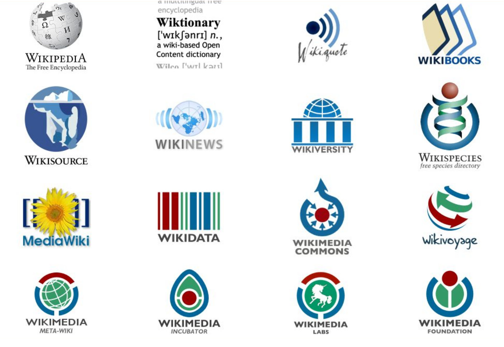

# Introduction

[The Wikimedia Foundation](https://wikimediafoundation.org/) is am American non-profit organisation founded in 2013. Wikimedia runs several projects to enable access to knowledge and leverage [crowdsourcing](https://www.merriam-webster.com/dictionary/crowdsourcing). The best known and largest of these projects is [Wikipedia](https://www.wikipedia.org/) which is an online crowdsourced encyclopedia.

## Other noteable projects:
* [Wikicommons](https://commons.wikimedia.org/wiki/Main_Page)
  * A shared media repository
* [Wikisource](https://en.wikisource.org/wiki/Main_Page)
  * An archive of primary source documents with transcription and translation
* [Wikitionary](https://en.wiktionary.org/wiki/Wiktionary:Main_Page)
  * A free multi-lingual dictionary
* [Wikidata](https://www.wikidata.org/wiki/Wikidata:Main_Page)
  * A large-scale linked data project.
