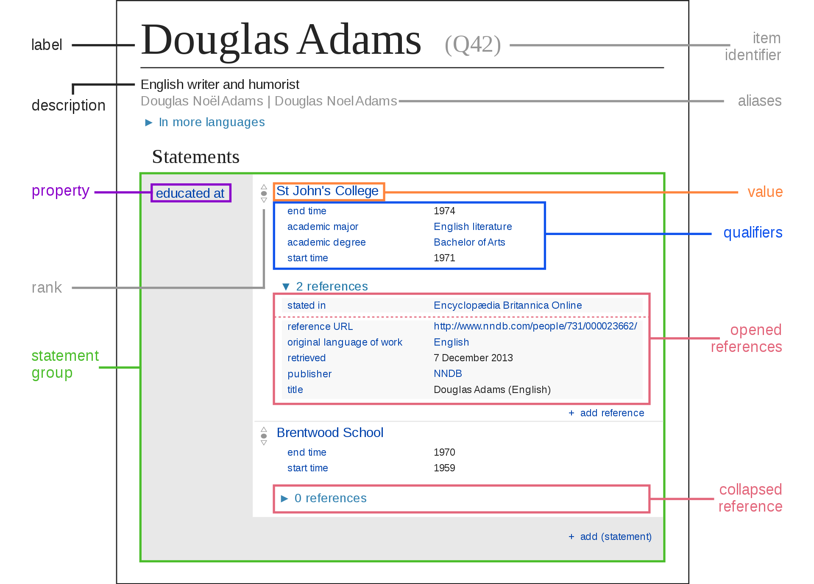

# Wikidata

<blockquote>“Wikidata… aims to create a free knowledge base about the world that can be read and edited by humans and machines alike.”</blockquote>

In 2012, the Wikimedia foundation launched Wikidata with the lofty goal of turning all of the world's knowledge into Linked Data. Wikipedia is focused on the "document" or "Wiki page" as a piece of information. Wikidata on the other hand is focused on a single piece of data for every entry.

Lead by Wikimedia Deutschland and funded as a project by:
* Allen Institute for Artificial Intelligence,
* Gordon and Betty Moore Foundation,
* Google, Inc.

The original Wikidata project had three phases:
* Centralising interlanguage links – links between Wikipedia articles about the same topic in different languages
* Providing a central place for informational card data for all Wikipedias
* Creating and updating list articles based on data in Wikidata

Phase 1 went live in 2013 and Wikidata is currently in phase 2, as of 2016.

* Learn more about the history of Wikidata: https://en.wikipedia.org/wiki/Wikidata#Development_history
* Current statistics outlining Wikidata's growth: https://www.wikidata.org/wiki/Wikidata:Statistics
* For a quick overview of how Wikidata works, explore at the "[Wikidata in brief](https://commons.wikimedia.org/wiki/File:Wikidata-in-brief-1.0.pdf)" handout.
{: .note}

## Wikidata Structure
Wikidata is a Linked Open Data project. Structured data which preserves the relationships between things. It leverages the principle of "[Transclusion](https://en.wikipedia.org/wiki/Transclusion)" which refers to the inclusion of a piece of information from one document into another. By using transclusion the "source" of a piece of information can be the same for many documents which makes it easier to maintain over time.

A large part of Wikidata's goal is to structure data that naturally lends itself to being structured such as dates or locations. Wikidata acts as a backbone to some information presented in other projects such as Wikipedia (eg. the informational card about a place).

Wikidata also has an open query tool which allows any user to explore what is in Wikidata through the query language [SPARQL](https://en.wikipedia.org/wiki/SPARQL).

* Learn more about SPARQL: https://www.wikidata.org/wiki/Wikidata:SPARQL_tutorial
{: .note}

Through the transclusion of individual pieces of information into many places Wikidata is able to equalising knowledge access because no one language gets prioritized. All languages associated with a datapoint are included in the entry for a concept.

On a community level Wikidata also supports community contributors by enabling micro-contributions which can be less work than Wikipedia contributions.

Same issue as other Wikimedia projects:
* Vandalism
* Slow growth
* Massive, ambitious, dataset
* Long-term maintenance
* Funding that kicked off the project was temporary
* Wikimedia foundation not formally supports but reliant on donations
* Higher learning curve for involvement than Wikipedia
* Community demographics, deep western bias
* Challenging ambition to “structure the sum of all human knowledge”

## Data Model

"The Wikidata repository consists mainly of items, each one having a label, a description and any number of aliases. Items are uniquely identified by a Q followed by a number, such as Douglas Adams (Q42).

Statements describe detailed characteristics of an Item and consist of a property and a value. Properties in Wikidata have a P followed by a number, such as with educated at (P69). "

* Learn more about Wikidata's structure: https://www.wikidata.org/wiki/Wikidata:Introduction.
{:. note}

## Tools to explore for WikiData
* [Reasonator](https://reasonator.toolforge.org/?q=Q8023) makes Wikidata Entries look easier to read
* [Wikidata Query Tool](https://query.wikidata.org/) allows (try selecting an Example query from the menu)
* [Scholia](https://www.wikidata.org/wiki/Wikidata:Scholia) accessed at https://scholia.toolforge.org/

# Wikidata for Teaching
Wikidata has a number of educational resources to help educators teach linked open data concepts.

* Learn more and explore resources: https://www.wikidata.org/wiki/Wikidata:Wikidata_educational_resources
{: .note}

# Wikidata for Research
Wikibase is a powerful tool for exploring linked open data concepts and leveraging linked open data structures in the context of a research project.

* Explore Wikibase: https://wikiba.se/
{: .note}

## Example projects that use Wikibase
* https://linkedjazz.org/ (a project that shows the history of Jazz through linked open data)
* https://en.wikipedia.org/wiki/Wikipedia:WikiProject_Molecular_Biology/Genetics/Gene_Wiki (a project that is working to include every notable human gene in Wikipedia)
* https://blog.factgrid.de/welcome "FactGrid", which is a database for historians is run off of Wikibase.
* https://enslaved.org/ Michigan State University's "Enslaved" project brings together data on individuals who were enslaved by or involved in the slave trade.
