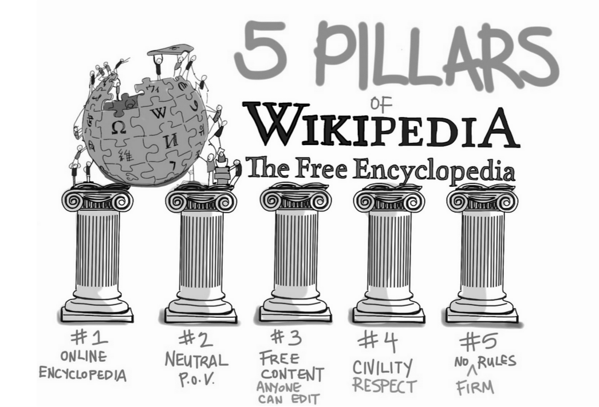

# Wikipedia
Wikipedia is a multilingual, web-based, free-content encyclopedia based on a model of openly editable content.
Edits occur in real-time and are written collaboratively by people of all ages, cultures and backgrounds. What is contributed is more important than the expertise or qualifications of the contributor.

Learn more about Wikipedia's history: [https://en.wikipedia.org/wiki/History_of_Wikipedia](https://en.wikipedia.org/wiki/History_of_Wikipedia).

## Five Pillars of Wikipedia

As with other other forms of knowledge production such as scholarly journals, the development of articles on Wikipedia is a process of information production governed by established norms. These are developed (and enforced) by those involved with the information production community.

The 5 Pillars of Wikipedia:
* Pillar 1: Online Encyclopedia
  * Scholarly materials typically involve original research whereas encyclopedias summarize previously published information
* Pillar 2: Neutral point of view
* Pillar 3: Free content that anyone can edit
* Pillar 4: Community members are expected to treat each other with civility and respect
* Pillar 5: There are no firm rules - this means that the way things are done now is dynamic

### Neutrality
Representing fairly and proportionately all of the significant views that have been published by reliable sources on a topic.

Avoid editorial bias which includes:
* Stating opinions as facts
* Stating seriously contested assertions as facts
* Stating facts as opinions
* Using judgmental language

Learn more about neutral points of view: https://en.wikipedia.org/wiki/Wikipedia:Neutral_point_of_view

### Reliable resources
Reliable sources for use are:
* Published by a third-party with a reputation for fact-checking and accuracy.
* May be academic and peer-reviewed
* May come from non-academic sources such as:
  * University-level textbooks
  * Books published by respected publishing houses
  * Magazines
  * Journals
  * Mainstream newspapers

Learn more about reliable resources: https://en.wikipedia.org/wiki/Wikipedia:Reliable_sources

### Consensus
Consensus on Wikipedia means:
* An iterative process of editing
* Compromise
* Discussion through talk pages

And consensus is assumed unless challenged.

Consensus on Wikipedia does not mean:
* Unanimity
* A majority vote
* Stasis

Learn more about consensus: https://en.wikipedia.org/wiki/Wikipedia:Consensus

### Conflict of Interest
Wikipedia's Conflict of Interest policy is largely focused on preventing contributions by an individual about themselves, their family, their clients, employers, or others who may have a relationship with them.

Learn more about Conflict of Interest: https://en.wikipedia.org/wiki/Wikipedia:Conflict_of_interest

Take a look at the [Wikipedia plain and simple conflict of interest guide](https://en.wikipedia.org/wiki/Wikipedia:Plain_and_simple_conflict_of_interest_guide).
